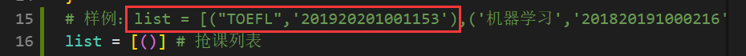

# Python 版本抢课说明

> Update on 2019-9-1\
> 选课系统由 湖南强智科技发展有限公司 所有版权，理论上可以通用

## 运行环境

* python 版本： 3.7.0及以上
* 需要的包: requests

## 使用前必做

1. 在第9行 data 中添加 `username` 和 `password`, 即 账号 和 密码， 用于 CAS 认证


2. 添加修改你要抢的课的 `名字` 和 `id`, 查看 id 的方法下面会讲，`名字`可任取



## 运行

``` bash
python3 SUSTC-qiangke.py
```

## 如何查看课程 id ？

1. 进入选课系统
2. 右键 `选课` 按钮，检查
3. 右侧或左侧出现 id , 如下

